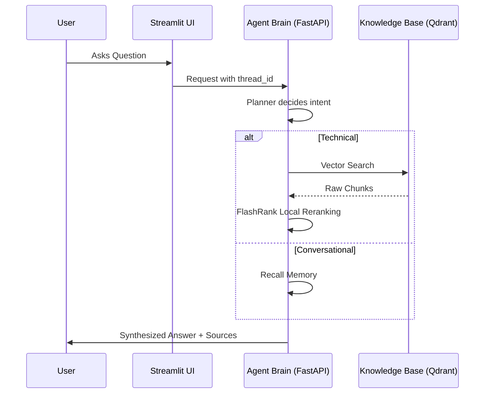

# Enterprise Agentic RAG Platform

<p align="center">
  
  
  
  
  
</p>

## Overview

A production-grade, state-of-the-art Retrieval-Augmented Generation (RAG) system built for speed, scalability, and deep observability. This platform leverages **LangGraph** to handle complex reasoning and a fully local, cloud-agnostic stack for document intelligence. 

Unlike standard RAG systems that treat every query identically, this **Agentic RAG** distinguishes between conversational interactions and technical requests. Using a **Planner-Retriever-Responder** architecture, it ensures technical answers are grounded in verifiable data while conversational queries remain fluid and fast.

---

## High-Level Flow



---

## Architecture & Features

### Ingestion Engine

A modular, high-performance pipeline designed to convert raw enterprise data into a searchable vector format entirely on-device, with no external OCR required.

* **Smart Parsing:** Handles PDFs (`pypdf`, `pdfplumber`), HTML (`BeautifulSoup`), Office Docs (`python-docx`, `python-pptx`), and plain text.
* **Semantic Chunking:** Paragraph-aware splitting (1500 chars) prevents hallucinated fragments.
* **Vectorization:** Embeddings generated via `gemini-embedding-2-preview` and stored in **Qdrant**.

### Node Intelligence (The Agentic Brain)

Powered by a LangGraph Cyclic State Machine to route and resolve queries intelligently.

* **Planner Node (Groq 70B):** Analyzes conversation history to route technical queries to the search pipeline or handle conversational inputs instantly from memory.
* **Retriever Node:**
* *Stage 1:* Fast Bi-Encoder Retrieval via Qdrant (Cosine Similarity).
* *Stage 2:* Deep Cross-Encoder Reranking via FlashRank (local ONNX models) for zero-latency, highly accurate semantic re-scoring.


* **Responder Node (Groq 70B):** Synthesizes final answers, citing retrieved sources strictly for technical responses.

### Guardrails (NeMo)

A determinative safety layer operating before the LLM pipeline.

* Blocks off-topic abuse, jailbreaks, and sensitive data leaks using semantic intent classification.
* Defines conversation flows via Colang rules.

### LLM Gateway (Portkey)

A proxy layer providing resilience, observability, and cost control.

* Automatic retries, load balancing, request timeouts, and semantic caching.
* Full prompt/response logging and per-feature analytics.

### Evaluation Pipeline (RAGAS)

Comprehensive testing across six critical failure modes:

1. **Faithfulness:** Hallucination detection.
2. **Answer Relevancy:** Topic adherence.
3. **Context Precision:** Reranking quality.
4. **Context Recall:** Retrieval completeness.
5. **Answer Correctness:** Factual overlap against ground truth.
6. **Tool Correctness:** Agent routing accuracy (Jaccard overlap).

---

## Project Structure

```text
Enterprise-Agentic-RAG/
│
├── app/                  # Core Python package (Agent, Pipelines, Services)
├── ui/                   # Premium Streamlit interface
├── DATA/                 # Ground-truth documentation for ingestion
├── DOCS/                 # Documentation suite
└── commands.md           # Master execution guide

```

---

## Observability & Tracing

* **Pydantic Logfire:** Tracks API latency, parsing steps, and database query times.
* **LangSmith:** Records graph state transitions, prompt versions, token usage, and chain-of-thought logic.

---

## Setup & Execution

### 1. Environment Configuration

Create a `.env` file referencing the `.env.example` template to configure your API keys (Groq, Portkey, Gemini, Qdrant, Logfire, LangSmith).

### 2. Universal Ingestion

Run the ingestion engine to process `DATA/` into Qdrant:

```bash
python -m app.ingestion.processor DATA --wipe

```

### 3. Start Backend & UI

```bash
# Terminal 1 — start the FastAPI backend
uvicorn app.main:app --reload --port 8000

# Terminal 2 — start the Streamlit UI
streamlit run ui/app.py

```
